# 时间序列预测损失函数 DTW, Soft-DTW, DILATE

本文主要介绍机器学习时间序列预测模型中的几种损失函数。

## 一、时间序列预测

**时间序列**是按时间顺序索引（或列出）的一系列的数据点。它是一系列离散时间数据，在涉及时间测量的应用科学和工程领域中广泛使用。比如说一段时间的温度变化或是证券价格等。

**时间序列预测**是通过分析时间序列数据以提取有意义的特征信息，根据先前观察到的值来预测未来一段时间的值。

时间序列预测的模型很多。传统的模型使用回归的方法进行建模，如ARMA/ARIMA等线性模型。也有基于机器学习的模型。基于机器学习的模型，最主要的关注点在模型本身，即如何更好地提高模型对输入信息特征提取能力，从而得到更好预测结果。这部分工作很多，不过不是本文的关注点。

在训练机器学习模型过程中，需要使用损失函数（loss function）来更新模型参数。不同的损失函数惩罚的内容不同，会在训练过程中将模型引到不同的方向。而在时间序列预测中，按照不同的惩罚目标选择或设计损失函数，也会影响模型最终的表现能力。Euclidean loss （即 MSE）是常用的损失函数，这里不再赘述。本文将另外介绍几种损失函数：DTW，Soft-DTW，DILATE。

## 二、DTW

> 本节主要参考 [1]

**DTW**（Dynamic Time Warping，动态时间规整）是一种计算两个时间序列之间相似度的方法。

给定两个时间序列，比如语音序列。由于每个人的发音方式、发音长短会不一样，这就导致了即使两段语音序列说的内容一样，序列整体上有非常相似的形状，序列也不能在时间点上一一对应。而是会出现波动延后、起伏区间不一的情况，如图1左图的形式。使用传统的欧几里得距离无法有效得求出两个时间序列的距离（或者相似度）。

如果能够通过一些算法，把两个序列规整对齐，减少延时与波动的影响，就可以更好衡量两种的相似度。DTW是一种通过 warping 的方式，把时间序列进行伸缩来计算相似度的算法。直观地来看，如图1右图的形式，时间序列上的点不再是一一对应，而是会出现”一对多“、”多对一“对应。

    
    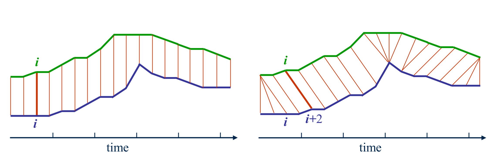    
         
    
图1：欧几里得距离与DTW距离的对齐
 

具体地来讲，记两个时间序列分别为 $\mathcal{A}= \{a_1,a_2,...,a_n\}$，$\mathcal{B}=\{b_1,b_2,...,b_m\}$。我们要找的 $\mathcal{A}$ 与 $\mathcal{B}$ 的对应关系可看成图2中红色路径$\textit{P}=\{p_1,...,p_s,...,p_k\}$，$p_s={(i_s,j_s)}$。$\textit{P}$ 被称作 *warping function*。

    
    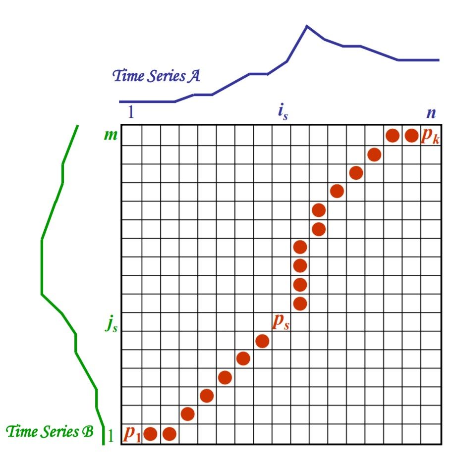    
         
    
图2：DTW算法求解路径
 

$\mathcal{A}$ 与 $\mathcal{B}$ 之间的时间正规化距离（Time-normalized distance）$D_{P}(\mathcal{A,\ B})$为：
$$
D_{P}(\mathcal{A,\ B})=[\frac{\sum_{s=1}^{k}\delta(p_s) \cdot {w_s}}{\sum_{s=1}^{k} {w_s}}]\tag{2-1}\\
\delta(p_s):i_s与j_s间距离,\\
w_s>0:加权系数.
$$
算法的目标是找到最佳的路径 $P_0$，满足 $P_0=\mathop{\mathrm{argmin}}\limits_{P}(D_{P}(\mathcal{A,\ B}))$。如果不加限制的话 $P$ 的搜索空间将会是指数次的，因此需要为 $P$ 增加一些限制条件来减少搜索空间大小。限制有以下几点：

* 单调性（Monotonicity）：$i_{s-1}\leq i_s$ 并且 $j_{s-1} \leq j_s$ 。

  路径不能走“回头路”，确保特征不会在路径中重复。

* 连续性（Continuity）：$i_{s-1}-i_s\leq 1$ 并且 $j_{s-1}-j_s\leq 1$ 。

  路径不能“跳跃”，确保没有元素被忽略。

* 边界条件（Boundary Conditions）：$i_1=1,i_k=n$ 并且 $j_1=1,j_k=m$。

  路径从左下方开始到右上方结束，确保序列整体都被考虑。

* 规整窗口（Warping Window）：$|i_s-j_s|\leq window$ ，$window\geq0$。其中 $window$ 为窗口大小。

  一个好的路径不能偏离对角线过远，确保路径不会在某些序列特征上过度停留。

* 斜率限制（Slope Constraint）：$\frac{j_{s_p}-j_{s_0}}{i_{s_p}-i_{s_0}}\leq p$ 并且 $\frac{i_{s_q}-i_{s_0}}{j_{s_q}-j_{s_0}}\leq q$ 。$p,q\geq 0$，$p,q$ 分别为 $y,x$ 方向的步数。

  路径斜率不能过陡或过缓，防止很短的序列匹配很长的序列。

  

加权系数则根据目标，选择不同形式，比如说有以下形式：

* $w_s=(i_s-i_{s-1})+(j_s-j_{s-1})$ （对称形式）
* $w_s=(i_s-i_{s-1})$ （非对称形式）
* $w_s=(j_s-j_{s-1})$ （非对称形式）

记 $C=\sum_{s=1}^k w_s$，有 ：
$$
D_{P_0}(\mathcal{A,\ B})=\frac{1}{C}\cdot \mathop{\mathrm{min}}\limits_P [\sum_{s=1}^{k}\delta(p_s) \cdot {w_s}].\tag{2-2}
$$

$P$ 的单调性和连续性，意味着 $P$ 只有三条路可走：向右一格 $\rightarrow$、向上一格 $\uparrow$、向右上一格 $\nearrow$。再加上 $P$ 的边界条件，$P_0$ 的求解因此变成了一个动态规划（Dynamic Programming）问题。记这个动态规划问题为 $r$，则有：

* 初始条件：$r_{1,1}=\delta_{1,1}\cdot w_{1,1}$。

* 动态规划等式：
$$
r_{i,j}=\delta_{i,j}\cdot w_{i,j}+ \mathrm{min}\{r_{i,j-1},r_{i-1,j},r_{i-1,j-1}\}.
\tag{2-3}
$$

* 规整窗口限制：$j-window\leq i \leq j+window$。

由边界条件可知，$r_{n,m}$ 表示着路径 $P$ 的终点，因此可以得到 ：
$$
D_{P_0}(\mathcal{A,\ B})=\frac{1}{C}\cdot r_{n,m}.
\tag{2-4}
$$
由此 DTW 算法得到了两个序列的相似度。

## 三、Soft-DTW

> 本节主要参考 [2]

欧几里得损失函数（Euclidean loss，亦即 MSE）是时间预测模型中常用的损失函数。由于噪声的存在，即使前半段序列形状类似，对于要进行预测的后半段序列也不会完全一致。如图3所示，深色线都是可能的序列，它们有类似的形状，但是有不同的波动时间点。由于 Euclidean loss 是一一对应计算距离的，因此最后预测结果会变成逐时间取平均，如红线所示。这样的结果肯定是非常糟糕的。

    
    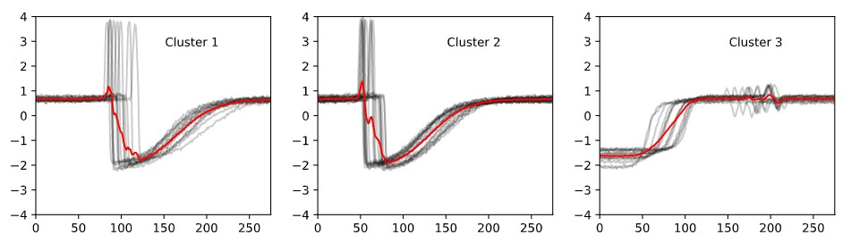    
         
    
图3：使用欧几里得距离的结果
 

如果使用 DTW 距离作为损失函数，那么这些通过时间维度的规整，我们可以得到更符合实际情况的预测结果。

    
    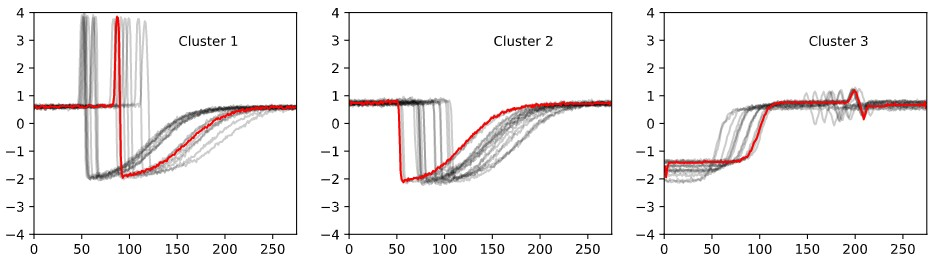    
         
    
图4：使用DTW距离的结果
 

    
    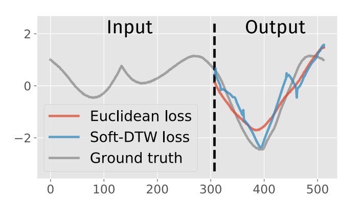    
         
    
图5：使用 Euclidean loss 与 DTW loss 预测对比
 

DTW 算法通过动态规划求解了两个序列的相似度。这个过程是离散的，不可微的。如果要将其应用作为神经网络的损失函数，这是不行的。因为神经网络通过对损失函数结果进行梯度下降的方法，更新参数，要求损失函数可微。针对这样的问题，Marco Cuturi 等人使用了 soft minimum 来代替 DTW minimum，设计了可微的**Soft-DTW**。

对于两个序列 $ \mathbf{x}=(x_1,...,x_n)\in \mathbb{R}^{p*n}$ 与 $ \mathbf{y}=(y_1,...,y_m)\in \mathbb{R}^{p*m}$，定义代价矩阵（cost matrix）$\Delta(\mathbf{x},\mathbf{y}):=[\delta(x_i, y_j)])_{ij}\in\mathbb{R}^{n*m}$。其中 $\delta(\cdot,\cdot)$ 是可微代价函数，$\delta:\mathbb{R}^{p}\times \mathbb{R}^{p} \rightarrow \mathbb{R}_{+}$。通常 $\delta(\cdot,\cdot)$ 可使用欧几里得距离。

定义集合 $R=[r_{i,j}],\ R\in\mathbf{R}^{n\times m}$ 为路径上的代价和 $r_{i,j}$ 组成的集合。根据上一节，DTW 算法中的动态规划等式（使用$w_{i,j}\equiv 1$）为
$$
r^{DTW}_{i,j}=\delta_{i,j}+ \mathrm{min}\{r_{i,j-1},r_{i-1,j},r_{i-1,j-1}\}.
\tag{3-1}
$$
由于 $\mathrm{min}$ 是一个离散的过程，导致了 DTW 的离散。Soft-DTW 使用了连续的 soft-min：
$$
r_{i,j}=r^{Soft-DTW}_{i,j}=\delta_{i,j}+ \mathrm{min}^{\gamma}\{r_{i,j-1},r_{i-1,j},r_{i-1,j-1}\}.
\tag{3-2}
$$

$$
其中：\mathrm{min}^{\gamma}\{a_1,...a_n\}=\begin{cases}
\mathrm{min}_{i\leq n}a_i,&\gamma=0,\\
-\gamma log\sum_{i=1}^{n}e^{-a_i/\gamma}, &\gamma>0.
\end{cases}
\tag{3-3}
$$
Soft-DTW 使用 $\mathrm{min}^{\gamma}$ 替代了 $\min$。可以看到，当 $\gamma \rightarrow 0$ 时，$\mathrm{min}^{\gamma}\rightarrow \mathrm{min} $。

接下来就是如何基于此定义前向和反向传播的过程。

对于前向传播，定义 $\mathcal{A}_{n,m}\subset\{0,1\}^{n\times m}$ 为两个长分别为 $n$ 和 $m$ 序列上的校准矩阵集（alignment matrices）。对于 $\mathrm{A}=[a_{i,j}]$ ，$\mathrm{A}\in \mathcal{A}_{n,m}$，$\mathrm{A}$ 为一条路径。$a_{i,j}=1$，表示点 $(i,j)$ 在路径上，即图2中的红点。$a_{i,j}=0$，表示点 $(i,j)$，不在路径上，即图2中没有着色的点。

因此 $\mathcal{A}_{n,m}$ 代表了所有从 $(1,1)$ 到 $(n,m)$ 的路径，并满足第二节中 $P$ 同样的要求，即所有路径只能$\rightarrow,\ \uparrow,\ \nearrow$ 三种方向每次走一步。内积 $\big<\mathrm{A},\ \Delta(\mathbf{x},\mathbf{y})\big>$ 即为这条路径下的代价和。据此，我们可以定义 $\gamma$-Soft-DTW：
$$
\begin{align*}
\mathbf{dtw_{\gamma}}(\mathbf{x},\mathbf{y})=&\mathrm{min}^\gamma\{\big<\mathrm{A},\Delta(\mathbf{x},\mathbf{y})\big>,\ \mathrm{A}\in\mathcal{A}_{n,m}\}\\\\
=&-\gamma\ log(\sum_{\mathrm{A}\in \mathcal{A}_{n,m}}e^{-\big<\mathrm{A},\Delta(\mathbf{x},\mathbf{y})\big>/\gamma}).
\end{align*}
\tag{3-4}
$$
原始的 DTW 算法计算的就是 $\gamma=0$ 时的 $\mathbf{dtw_{0}}(\mathbf{x},\mathbf{y})$，Soft-DTW 关注 $\gamma>0$ 的情况。$\mathbf{dtw_{\gamma}}(\mathbf{x},\mathbf{y})$ 可通过式$\mathbb{(3-2)}$ 过程得到，$\mathbf{dtw_{\gamma}}(\mathbf{x},\mathbf{y})=r_{n,m}$。具体过程如图6。

    
    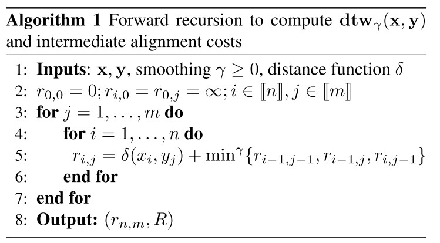    
         
    
图6：前向传播计算
 

对于反向传播，需要得到梯度 $\nabla_{\mathbf{x}}\mathbf{dtw_{\gamma}}(\mathbf{x},\mathbf{y})$。

由链式法则，可以得到：
$$
\nabla_{\mathbf{x}}\mathbf{dtw_{\gamma}}(\mathbf{x},\mathbf{y})=(\frac{\partial\Delta(\textbf{x,y})}{\partial\mathbf{x}})^{T}\;(\frac{\partial\mathbf{dtw_\gamma}(\mathbf{x},\mathbf{y})}{\partial\Delta(\mathbf{x},\mathbf{y})})=(\frac{\partial\Delta(\textbf{x,y})}{\partial\mathbf{x}})^{T}\;(\frac{\partial r_{n,m}}{\partial\Delta(\mathbf{x},\mathbf{y})}),
\tag{3-5}
$$
其中，$(\frac{\partial\Delta(\textbf{x,y})}{\partial\mathbf{x}})$ 是 $\Delta$ 相对于 $\mathbf{x}$ 的雅克比（Jacobian）矩阵，可以看作从 $\mathbb{R}^{p\times n}$ 到 $\mathbb{R}^{n\times m}$ 的线性映射。由于 $\Delta(\mathbf{x},\mathbf{y}):=[\delta(x_i, y_j)])_{ij}$，而 $\frac{\partial r_{n,m}}{\partial\delta_{i,j}}=\frac{\partial r_{n,m}}{\partial r_{i,j}}\frac{\partial r_{i,j}}{\partial \delta_{i,j}}=\frac{\partial r_{n,m}}{\partial r_{i,j}}\cdot 1=\frac{\partial r_{n,m}}{\partial r_{i,j}}$。故定义元素 $e_{i,j}=\frac{\partial r_{n,m}}{\partial r_{i,j}}$ ，集合 $\mathrm{E}=[e_{i,j}],\ \mathrm{E}\in\mathbf{R}^{n\times m}$。

因此可以得到：
$$
\nabla_{\mathbf{x}}\mathbf{dtw_{\gamma}}(\mathbf{x},\mathbf{y})=(\frac{\partial\Delta(\textbf{x,y})}{\partial\mathbf{x}})^{T}\;\mathrm{E}.
\tag{3-5}
$$

如果使用框架中的自动求导，则要从$\mathrm{E}_{1,1}$ 逐步求到 $\mathrm{E}_{n,m}$。其中每个 $\mathrm{E}_{i,j}$ 的计算都要 $O(ij)$ 的时间复杂度，因此总时间复杂度是 $O(n^2m^2)$。其中有大量重复计算。作者提出了一种动态规划的方法计算 $\mathrm{E}$，将时间复杂度降到了 $O(nm)$。该方法如下文所示。

$\mathrm{E}$ 中元素的求得过程如下所示，首先根据链式法则有：
$$
\underbrace{\frac{\partial r_{n,m}}{\partial r_{i,j}}}_{e_{i,j}}=
\underbrace{\frac{\partial r_{n,m}}{\partial r_{i+1,j}}}_{e_{i+1,j}}\frac{\partial r_{i+1,j}}{\part r_{i,j}}+
\underbrace{\frac{\partial r_{n,m}}{\partial r_{i,j+1}}}_{e_{i,j+1}}\frac{\partial r_{i,j+1}}{\part r_{i,j}}+
\underbrace{\frac{\partial r_{n,m}}{\partial r_{i+1,j+1}}}_{e_{i+1,j+1}}\frac{\partial r_{i+1,j+1}}{\part r_{i,j}}.
\tag{3-6}
$$

又根据式$\mathbb{(3-2)}$，有：
$$
r_{i+1,j}=\delta_{i+1,j}+ \mathrm{min}^{\gamma}\{r_{i+1,j-1},r_{i,j},r_{i,j-1}\}.
\tag{3-7}
$$
对式$\mathbb{(3-7)}$两边对 $r_{i,j}$ 求偏导可得：	
$$
\frac{\partial r_{i+1,j}}{\partial r_{i,j}}=\frac{e^{-r_{i,j}/\gamma}}{e^{-r_{i+1,j-1}/\gamma}+e^{-r_{i,j}/\gamma}+e^{-r_{i,j-1}/\gamma}}.
\tag{3-8}
$$
对式$\mathbb{(3-8)}$两边取对数，并乘 $\gamma$，可化简为：
$$
\begin{align*}
\gamma\  log\frac{\partial r_{i+1,j}}{\partial r_{i,j}}=&\mathrm{min}^\gamma\{r_{i+1,j-1},r_{i,j},r_{i,j-1}\}-r_{i,j}\\
=&r_{i+1,j}-\delta_{i+1,j}-r_{i,j}.
\tag{3-9}
\end{align*}
$$
同样可以得到：
$$
\begin{align*}
\gamma\  log\frac{\partial r_{i,j+1}}{\partial r_{i,j}}=&r_{i,j+1}-r_{i,j}-\delta_{i,j+1}.\\
\gamma\  log\frac{\partial r_{i+1,j+1}}{\partial r_{i+1,j}}=&r_{i,j+1}-r_{i,j}-\delta_{i+1,j+1}.\\
\tag{3-9}
\end{align*}
$$
结合式$\mathbb{(3-6)}$与式$\mathbb{(3-9)}$，可知计算 $\mathrm{E}=[e_{i,j}]$ 的过程可从 $e_{n,m}=\frac{\partial r_{n,m}}{\partial r_{n,m}}=1$ 开始，逐个计算至 $e_{1,1}$。具体过程如图7。

    
    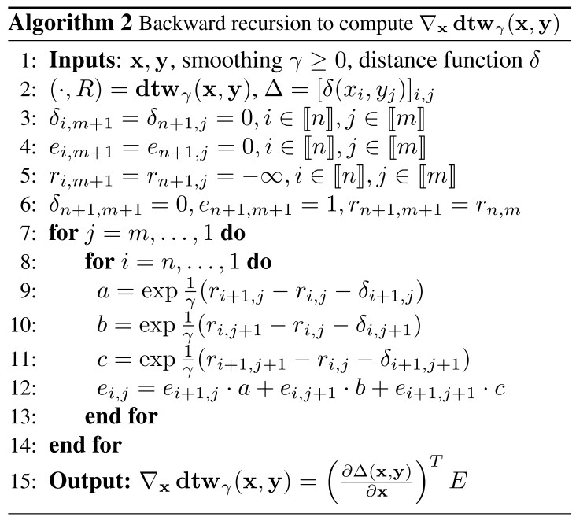    
         
    
图7：反向传播计算
 

#### 实验结果

使用多层感知器（MLP）作为神经网络结构。损失函数使用了 $\gamma=1,\ 0.1,\ 0.01,\ 0.001$ 的 Soft-DTW loss 以及 Euclidean loss。训练完成后，使用 DTW loss 作为 eval 指标，结果如图8所示。

    
    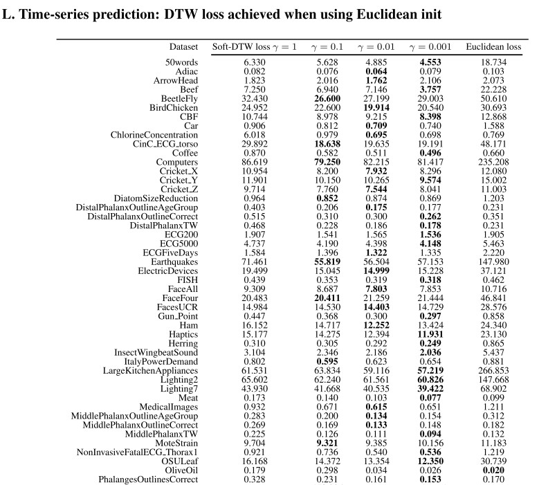    
         
    
图8：实验结果
 

可以看到使用 Soft-DTW 作为损失函数结果大幅优于使用 Euclidean loss 作为损失函数。并且小的 $\gamma$ 值会有较好的结果。

## 四、DILATE

> 本节主要参考 [3]

Soft-DTW 提供了一种可微的DTW算法，较之Euclidian loss，其能使预测结果更好匹配实际情况的形状，但是Soft-DTW 并没有考虑预测的时延。比如说对于天气预报，正确的结果是1个小时后会有一场大暴雨。Euclidian loss 预测告诉你1个小时后会有场雨，但是场中雨；Soft-DTW 预测告诉你未来会有场大暴雨，但会在2个小时之后来。对于时间要求更精确的预测场景，比如股价预测，虽然波动峰值形状预测对了，但是时间点预测错了，这对于买入/卖出操作来说会是一场灾难。

    
    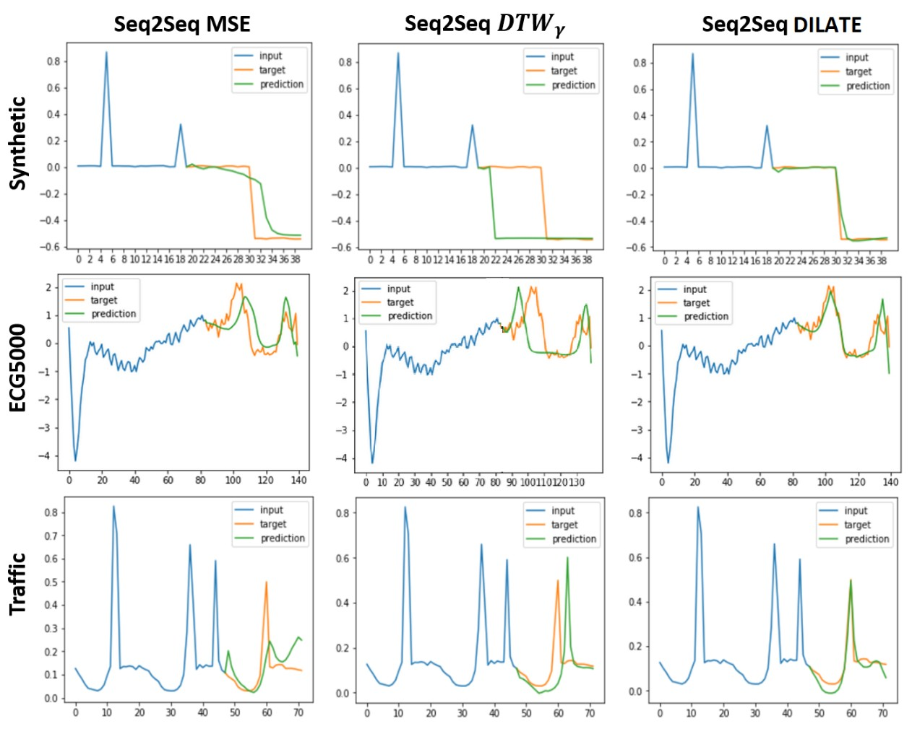    
         
    
图9：MSE 预测对了变化时间点，DTW 预测对了形状，DILATE 能够权衡时间与形状进行综合预测。
 

基于这样的原因，Vincent Le Guen 等人在 Soft-DTW 的基础上提出了 DILATE（DIstortion Loss including shApe and TimE，时间与形状失真损失），同时考虑形状与时延。

因为要考虑时延，因此用于对比的两个序列要一样长。对于序列 $ \mathbf{x}=(x_1,...,x_n)\in \mathbb{R}^{p*n}$ 与 $ \mathbf{y}=(y_1,...,y_m)\in \mathbb{R}^{p*n}$，DILATE 将损失定义成了两部分：
$$
\mathcal{L}_{DILATE}(\mathbf{x},\mathbf{y})=\alpha\cdot\mathcal{L}_{shape}(\mathbf{x},\mathbf{y})+(1-\alpha)\cdot\mathcal{L}_{temporal}(\mathbf{x},\mathbf{y}).
\tag{4-1}
$$

其中：

* $\mathcal{L}_{shape}(\mathbf{x},\mathbf{y})$ 是两个序列的形状损失函数（Shape loss function）。
* $\mathcal{L}_{temporal}(\mathbf{x},\mathbf{y})$ 是两个序列的时间损失函数（Time loss function）。
* $\alpha\in[0,1]$ 是一个超参数，用于划分对形状与时间的权重。

对于 $\mathcal{L}_{shape}(\mathbf{x},\mathbf{y})$，它就是 Soft-DTW loss $\mathbf{dtw_{\gamma}}(\mathbf{x},\mathbf{y})$。同时代价矩阵 $\Delta(\mathbf{x},\mathbf{y}):=[\delta(x_i, y_j)])_{ij}\in\mathbb{R}^{n*n}$，与校准矩阵集  $\mathcal{A}_{n,n}\subset\{0,1\}^{n\times n}$ 定义也与第三节中相同。

对于 $\mathcal{L}_{temporal}(\mathbf{x},\mathbf{y})$，其目的在于惩罚 DTW 算法中时延过大的匹配。换句话说，就是在图2这条红色路径中，对角线上的点是时间线上一一匹配的。偏离对角线越远的点，相当于有越大的时延。 $\mathcal{L}_{temporal}(\cdot,\cdot)$ 目的就在于通过惩罚这些偏离对角线过远的匹配，来减少预测的时延。

首先对于前向传播过程，我们知道  $\mathrm{A}\in \mathcal{A}_{n,n}$ 为一条路径。定义$\mathrm{\Omega}=[\omega_{i,j}]$， $\mathrm{\Omega}\in\mathbb{R}^{n\times n}$ 为惩罚矩阵（penalty matrix），$DILATE$ 选用了  $\omega_{i,j}=\frac{1}{n^2}(i-j)^2$。

定义 $\mathbf{TDI}$（Time Distortion Index，时间损失指数）：
$$
\mathbf{TDI}(\mathbf{x},\mathbf{y})=\big<\mathrm{A}^{*},\mathrm{\Omega}\big>=\Big<\mathop{\mathrm{argmin}}\limits_{\mathrm{A}\in\mathcal{A}_{n,n}}\big<\mathrm{A},\Delta(\mathbf{x},\mathbf{y})\big>,\mathrm{\Omega}\Big>.
\tag{4-2}
$$

$\mathbf{TDI}$ 对路径 $\mathrm{A}^{*}$ 做出了时延惩罚。由式$(\mathbb{4-2})$可知，$\mathbf{TDI}$ 仍是不可微的。原因出在了 $\mathrm{A}^{*}$ 的求解上，而我们希望找到一条可微的路径。由于 $\mathrm{A}^{*}=\nabla_{\Delta}\mathbf{dtw}(\mathbf{x},\mathbf{y})=\frac{\partial\mathbf{dtw}(\mathbf{x},\mathbf{y})}{\partial\Delta(\mathbf{x},\mathbf{y})}$，故可以定义 
$$
\mathrm{A}_{\gamma}^{*}=\nabla_{\Delta}\mathbf{dtw_{\gamma}}(\mathbf{x},\mathbf{y})=\frac{\partial\mathbf{dtw}_{\gamma}(\mathbf{x},\mathbf{y})}{\partial\Delta(\mathbf{x},\mathbf{y})}.
\tag{4-3}
$$
参考式$(\mathbb{3-5})$，$\mathrm{A}_{\gamma}^{*}$ 其实就是 $\mathbf{dtw}_\gamma(\mathbf{x},\mathbf{y})$ 反向传播中定义的矩阵 $\mathrm{E}$。

据此可以得到：
$$
\mathcal{L}_{temporal}(\mathbf{x},\mathbf{y})=\big<\mathrm{A}_{\gamma}^{*},\mathrm{\Omega}\big>.
\tag{4-4}
$$

$$
\begin{align*}
\mathcal{L}_{DILATE}(\mathbf{x},\mathbf{y})
=&\alpha\cdot\mathcal{L}_{shape}(\mathbf{x},\mathbf{y})+(1-\alpha)\cdot\mathcal{L}_{temporal}(\mathbf{x},\mathbf{y}),\\

=&\alpha\cdot\mathbf{dtw}_\gamma(\mathbf{x},\mathbf{y})+(1-\alpha)\cdot\big<\nabla_{\Delta}\mathbf{dtw}_\gamma(\mathbf{x},\mathbf{y}),\mathrm{\Omega}\big>,\\

=&\alpha\cdot\mathbf{dtw}_\gamma(\mathbf{x},\mathbf{y})+(1-\alpha)\cdot\big<\mathrm{A}_{\gamma}^{*},\mathrm{\Omega}\big>.
\end{align*}
\tag{4-5}
$$

对于反向传播过程，则需要计算 Hessian 矩阵 $\nabla^{2}\mathbf{dtw}{(\mathbf{x},\mathbf{y})}$，作者也采取了类似第三节中的动态规划过程求解，以减少计算量。详细过程不再列出，可参考原论文。

$\mathcal{L}_{DILATE}(\mathbf{x},\mathbf{y})$ 是先得到 $\mathbf{dtw}_\gamma(\mathbf{x},\mathbf{y}) $ 中的“最优“路径 $\mathrm{A}_{\gamma}^{*}$，再计算 $\mathcal{L}_{temporal}(\mathbf{x},\mathbf{y})$，这相当于时延惩罚基于形状惩罚的结果。如果要把形状和时延同时进行惩罚，则仿照式$\mathbb(3-4)$与式$\mathbb{(4-1)}$，定义：
$$
\mathcal{L}_{DILATE^t}(\mathbf{x},\mathbf{y})
=-\gamma\ log(\sum_{\mathrm{A}\in \mathcal{A}_{n,n}}e^{-\big<\mathrm{A},\alpha\cdot\Delta(\mathbf{x},\mathbf{y})+(1-\alpha)\cdot\mathrm{\Omega}\big>/\gamma}).
\tag{4-6}
$$
换而言之，即：
$$
r_{i,j}=r^{DILATE^t}_{i,j}=\alpha\cdot\delta_{i,j}+(1-\alpha)\cdot\omega_{i,j}+ \mathrm{min}^{\gamma}\{r_{i,j-1},r_{i-1,j},r_{i-1,j-1}\}.
\tag{4-7}
$$

#### 实验结果

分别使用多层感知器（MLP）以及 Seq2Seq 模型对三个数据集进行了实验。使用 MSE，DTW 以及 TDI 作为 eval指标。超参数设定 $\gamma=0.01$，$\alpha=0.5$（对于 Synthetic 与 ECG5000），$\alpha=0.8$（对于 Traffic）。结果如图10所示。

    
    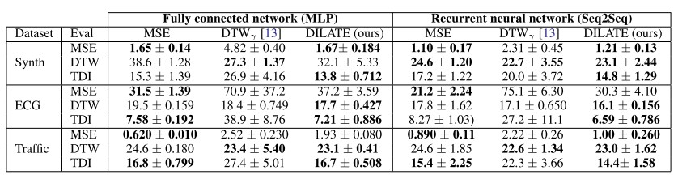    
         
    
图10：实验结果
 

可以 DILATE 在 DTW 与 TDI 指标上有比较好的表现。在 MSE 指标上，与使用 MSE loss 训练的结果相比，结果也较接近。DILATE 的时延惩罚起到了作用。

同时还对加速效果以及 $\alpha$ 的影响做了实验，结果如图11所示。

    
    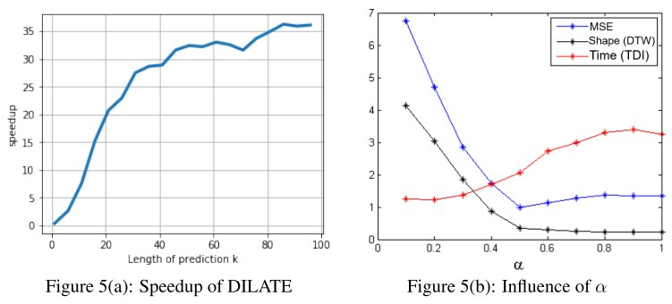    
         
    
图11：实验结果
 

## 五、总结 

#### 损失函数间的关系

本文介绍了三种时间序列预测的损失函数：DTW，Soft-DTW，DILATE。这三种损失函数的关系是迭代改进的。DTW 在 Euclidean loss 的基础通过规整的方式，将衡量两个时间序列相似度的方法从一一对应比较，变为通过规整后比较具体的形状。Soft-DTW 则是给出了可微的 DTW 形式，使其可用于机器学习模型训练中。DILATE 则是借鉴 Euclidean loss 的一一对应形式，在 Soft-DTW 基础上附加了时延惩罚。三者的关系可以认为是对式$\mathbb(2-3)$的不断改进：
$$
r_{i,j}=\delta_{i,j}\cdot w_{i,j}+ \mathrm{min}\{r_{i,j-1},r_{i-1,j},r_{i-1,j-1}\}.
\tag{2-3}
$$
式$\mathbb(2-3)$是原始的 DTW 计算递推式。Soft-DTW 为了使其可微，使用可微的 $\mathrm{\min}^{\gamma}$ 替代了 $\mathrm{\min}$。DILATE 为了同时惩罚时延，则是设计了相应的 $w_{i,j}=f(|i-j|)$，$f$ 是增函数。并且把 $\delta_{i,j}\cdot w_{i,j}$ 替换为 $\alpha\cdot\delta_{i,j}+(1-\alpha)\cdot\omega_{i,j}$（实际上这是 DILATEt 的做法，DILATE 不完全一致但思路一致）。但这样的替换同时，DTW 是否与 Euclidean loss 有关系呢？实际上让 $w_{i,j}=\begin{cases}1,&i=j,\\+\infty,&i\neq j.\end{cases}$，这就变成了 Euclidean loss。这些时间序列损失函数实际上是统一的。

#### 使用中的选择

本文所言的时间序列损失函数将损失分为了两部分：Shape loss 与 Time loss。

引入 DTW （即引入 shape loss）的前提是由于实际情况中噪声的存在，对于相似的输入时间序列簇，需要进行预测的未来时间序列会出现不同程度的波动，波动包括幅度起伏与时延波动。Euclidean loss 由于是一一对应的，因此会对这些波动进行平均，导致最终预测结果平滑化。而 DTW 考虑的 shape loss 可减少时延波动影响。

但是，前提中的噪声实际上不完全是随机噪声。输入数据范围缺失、模型提取特征能力不够强大等原因，都会导致模型预测能力不足，因此无法区别细微波动导致的结果。比如还是说天气预报，要预测一个地区的未来降水。这个地区只有一个气象监测点、一个小时汇报一次。其次或是用的模型只是很简单的模型，没法把监测到的数据特征提取出来（当然假设的情况非常极端）。那么对于整个过程，必将是充满”噪声“的。输入的时间序列数据区分度低，模型提取能力也差。只能预测未来有多大规模的雨，但说不准是什么时候下。这个时候使用 DTW 来训练一定是效果比较好的。

但是如果说这个地区有100个气象监测点、一分钟汇报一次。其次用的模型提取特征能力很强。那么首先对于数据来说，区分度就非常高，没有很多相似的输入时间序列簇。另外模型的能力很强，使其对于微小波动造成的影响能够充分捕捉。仅仅使用 Euclidean loss 也能获得非常好的结果。

然而实际面对的情况，是介于两个极端之间的。因此需要根据输入数据的充分度、模型提取特征能力，以及预测目标的着重点，来合理选择 shape loss 与 time loss，并分配相应的权重。

## 参考

[1] http://www.mathcs.emory.edu/~lxiong/cs730_s13/share/slides/searching_sigkdd2012_DTW.pdf

[2] Marco Cuturi and Mathieu Blondel. 2017. Soft-DTW: A differentiable loss function for time-series. 34th Int. Conf. Mach. Learn. ICML 2017 2, (2017), 1483–1505.

[3] Vincent Le Guen and Nicolas Thome. 2019. Shape and Time Distortion Loss for Training Deep Time Series Forecasting Models. NeurIPS (2019), 1–13.